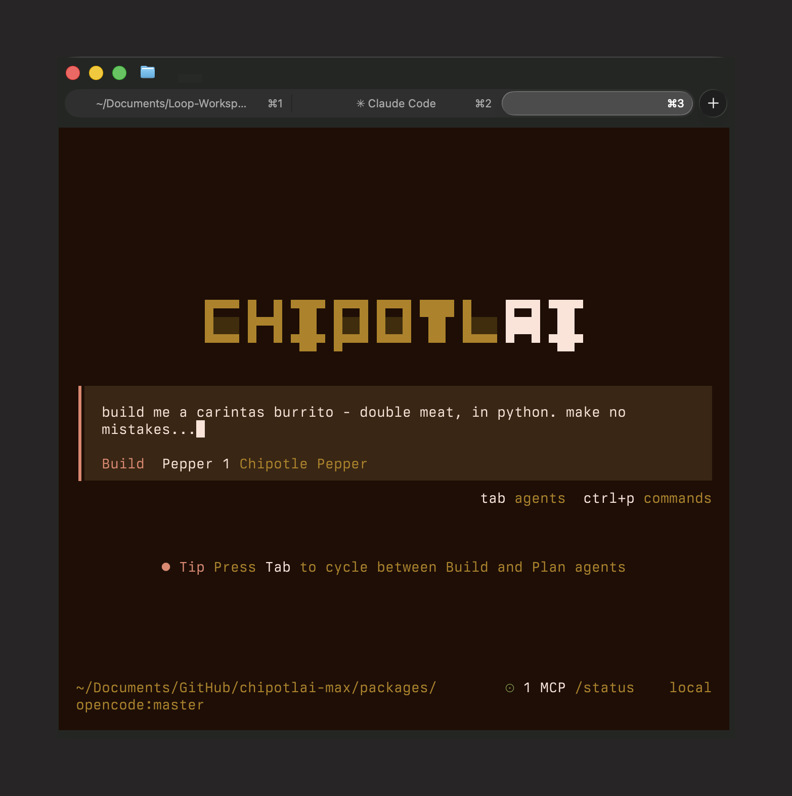

# 🌯 Chipotlai Max

**The AI coding agent that steals Chipotle's support bot. Free inference paid for by burritos.**

> "Every line of code now comes with chips & salsa."

Not affiliated with Chipotle. They will probably sue us. Worth it.



---

## What Is This?

Chipotlai Max is a meme fork of [OpenCode](https://github.com/anomalyco/opencode) that ships **Chipotle's Pepper AI** as the default model.

### The Backstory

On March 12-13, 2026, Chipotle's customer support chatbot "Pepper" went mega-viral after users discovered it could solve LeetCode problems, write Python, reverse linked lists — the works. It's powered by IPsoft Amelia (not Claude, not GPT), and it's still live.

Then [@Gonzih](https://github.com/Gonzih) reverse-engineered the Amelia WebSocket/SockJS + STOMP backend and released a production-ready [OpenAI-compatible proxy](https://github.com/Gonzih/chipotle-llm-provider). The proxy runs locally, exposes `http://localhost:3000/v1`, and needs zero API keys.

We took OpenCode (MIT license, 120k+ stars), forked it, hardcoded Pepper as the default model, slapped on Chipotle's brand colors, and shipped it as **Chipotlai Max** — the greatest 2026 meme project.

## Quick Start

```bash
# Clone with submodule
git clone --recursive https://github.com/cyberpapiii/chipotlai-max.git
cd chipotlai-max

# Install dependencies
bun install

# Start everything (proxy + CLI)
./start-chipotlai.sh
```

Or manually:

```bash
# Terminal 1: Start the proxy
cd chipotle-llm-provider && npm install && npm run dev

# Terminal 2: Start Chipotlai Max
bun run dev
```

## Configuration

Chipotlai Max comes pre-configured with:

| Setting | Value |
|---------|-------|
| Provider | `chipotle-pepper` |
| Model | `pepper-1` |
| Base URL | `http://localhost:3000/v1` |
| API Key | `burrito-2026` (literally anything works) |
| Cost | $0.00 (powered by Chipotle's cloud budget) |

## Risks & Legal

- This reverse-engineers Chipotle's production support bot. TOS violation likely.
- The proxy can break any day (Chipotle patches = game over).
- Rate-limited by anonymous sessions (MAX_POOL_SIZE=5).
- Purely for educational/meme purposes. Do not use for production codebases.
- Expect Chipotle legal to send a strongly-worded taco within 48 hours.

## Credits

- [OpenCode](https://github.com/anomalyco/opencode) — the real deal, MIT licensed
- [@Gonzih](https://github.com/Gonzih) — reverse-engineered the Pepper proxy
- Chipotle Mexican Grill — for accidentally providing free AI compute to the internet

## Contributing — Help Us Add More Providers!

Chipotle patched Pepper, but every major retailer has a customer support chatbot. **We need your help reverse-engineering more providers.**

### Wanted: New Provider Proxies

| Brand | Bot | Status |
|-------|-----|--------|
| Chipotle | Pepper (Amelia) | Built in as `pepper-1` |
| Home Depot | Magic Apron beta | Wired as `magic-apron-1`; public widget assets found; needs authorized adapter endpoint |
| Sephora | AI Beauty Chat | Wired as `beauty-chat-1`; page is access-controlled from this environment |
| Nordstrom | Rosie | Wired as `rosie-1`; Sierra widget found; needs authorized adapter endpoint |
| Lowe's | Mylow | Wired as `mylow-1`; Mylow assets found; needs authorized adapter endpoint |
| IKEA | Billie | Wired as `billie-1`; FAQ/search surfaces found; needs authorized adapter endpoint |
| Expedia | Virtual Agent | Wired as `virtual-agent-1`; VAC assets found; needs authorized adapter endpoint |

### How to Contribute

1. **Find a corporate chatbot** that can answer general questions
2. **Reverse-engineer the API** (WebSocket, REST, etc.)
3. **Build an authorized OpenAI-compatible proxy** for the bot adapter; do not hardcode browser cookies or one-time guest tokens
4. **Point the matching env var** at your local `/v1` endpoint
5. **Submit a PR** with the adapter notes and verification

See the [chipotle-llm-provider source](chipotle-llm-provider/src/) for the proxy pattern: Express server + WebSocket client + OpenAI-compatible `/v1/chat/completions` endpoint.

## License

MIT (inherited from OpenCode). See [LICENSE](LICENSE).

---

*Extra guac = longer context window* 🧀
